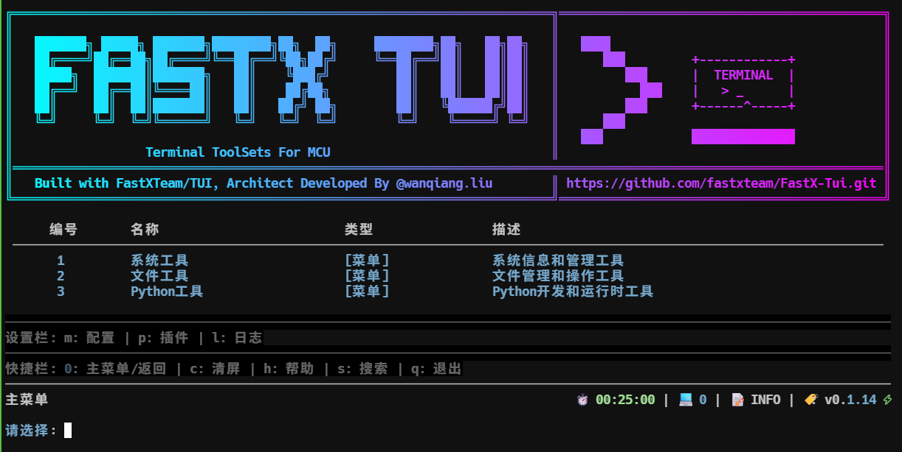

# FastX-Tui

统一视图架构的终端用户界面应用程序，提供系统管理、文件管理、Python开发工具等功能，采用模块化设计，支持插件扩展，拥有美观的终端界面和流畅的用户体验。



## 🎯 项目定位

FastX-Tui 是一款面向开发者和系统管理员的终端应用程序，旨在提供一个统一的、高效的终端工作环境，整合多种常用工具和功能，提升终端操作效率。

## 🏗️ 核心架构

- **统一视图架构** - 采用分层设计，视图与逻辑分离，支持灵活的界面布局
- **异步任务处理** - 内置异步任务队列，命令执行不阻塞主线程
- **插件扩展系统** - 支持插件开发和扩展，方便添加新功能
- **模块化设计** - 功能模块化，易于维护和扩展
- **美观终端界面** - 使用 Rich 库构建美观的终端界面

## ⚡ 核心优势

- **高效操作** - 统一的命令入口，减少上下文切换
- **异步执行** - 长时间运行的命令不影响界面响应
- **插件生态** - 支持插件扩展，可根据需求定制功能
- **美观界面** - 现代化的终端界面设计，提升使用体验
- **跨平台兼容** - 支持 Windows、Linux、macOS 等主流操作系统

## 📋 适用场景

- **系统管理** - 查看系统信息、网络状态、进程列表等
- **文件管理** - 目录浏览、文件搜索、文件树查看等
- **Python开发** - Python环境信息、包管理、模块导入检查等
- **日常工具** - 集成常用命令和工具，减少重复操作
- **插件开发** - 提供插件开发接口，方便扩展自定义功能

## ✨ 功能特性

### 🛠️ 平台工具
平台提供的通用工具集，包含系统工具、文件工具、Python工具。

#### 🖥️ 系统工具
- **系统信息** - 显示详细的系统信息
- **网络信息** - 查看网络配置
- **进程列表** - 列出所有运行中的进程
- **磁盘空间** - 显示磁盘使用情况
- **系统运行时间** - 查看系统运行时长

#### 📁 文件工具
- **目录列表** - 列出目录内容
- **文件树** - 显示文件系统树状结构
- **文件搜索** - 搜索文件系统中的文件

#### 🐍 Python工具
- **Python信息** - 显示Python环境信息
- **Python包** - 列出已安装的Python包
- **检查导入** - 检查Python模块导入

### 🔌 插件系统
- 支持插件扩展
- 动态加载插件
- 插件命令管理
- 插件菜单集成
- 插件开发接口

### ⚙️ 配置管理
- 查看和修改应用配置
- 个性化设置

### 📊 日志管理
- 查看和管理应用日志

### 📋 任务管理
- 异步任务队列
- 任务状态跟踪
- 任务结果查看
- 任务历史管理
- 快捷键 `t` 查看任务列表

## 📦 安装

### 从源码安装

```bash
# 克隆仓库
git clone https://github.com/yourusername/FastX-Tui.git
cd FastX-Tui

# 安装依赖
pip install -r requirements.txt

# 或者使用uv
echo "requirements.txt" > requirements-dev.txt
uv sync

# 运行应用
python main.py
```

### 从发布版本安装

1. 从 [Releases](https://github.com/yourusername/FastX-Tui/releases) 页面下载对应平台的可执行文件
2. 运行可执行文件

## 🚀 使用

### 基本操作

- **数字键** - 选择菜单或命令
- **0** - 返回主菜单/退出
- **c** - 清屏
- **h** - 显示帮助信息
- **s** - 搜索功能
- **l** - 日志管理
- **m** - 配置管理
- **p** - 插件管理
- **q** - 退出应用

### 快捷键

| 快捷键 | 功能 |
|--------|------|
| `0`    | 返回主菜单/退出 |
| `c`    | 清屏 |
| `h`    | 帮助 |
| `s`    | 搜索 |
| `l`    | 日志管理 |
| `m`    | 配置管理 |
| `p`    | 插件管理 |
| `q`    | 退出 |
| `t`    | 任务管理 |
| `u`    | 检查更新 |

## 🎨 界面

- **欢迎界面** - 显示版本信息和系统信息
- **主菜单** - 所有功能的入口
- **面包屑导航** - 显示当前菜单层级关系，位于菜单标题位置
- **底部面板** - 整合了设置栏、快捷栏和状态栏
  - 设置栏：显示配置、插件、日志等快捷入口
  - 快捷栏：显示常用快捷键
  - 状态栏：显示版本、时间、命令计数等信息

## 🔧 配置

应用配置文件位于 `config/default_config.json`，可以通过应用内的配置管理界面进行修改。

主要配置项：

- `auto_check_updates` - 是否自动检查更新
- `plugin_auto_load` - 是否自动加载插件
- `show_banner` - 是否显示横幅
- `show_welcome_page` - 是否显示欢迎页面
- `auto_clear_screen` - 是否自动清屏
- `use_async_tasks` - 是否使用异步任务执行命令

## 🧩 插件开发

### 插件结构

```python
# plugins/example_plugin.py
from core.plugin_manager import Plugin, PluginInfo
from core.menu_system import MenuSystem, ActionItem, CommandType

class ExamplePlugin(Plugin):
    """示例插件"""
    
    def get_info(self) -> PluginInfo:
        """获取插件信息
        
        必须实现此方法，返回插件的详细信息
        """
        return PluginInfo(
            name="Example Plugin",
            version="1.0.0",
            author="Your Name",
            description="一个示例插件",
            enabled=True,
            repository="https://github.com/yourusername/example-plugin",
            license="MIT"
        )
    
    def initialize(self):
        """初始化插件
        
        必须实现此方法，用于初始化插件的资源、连接数据库等
        """
        self.logger.info("Example Plugin initialized")
    
    def cleanup(self):
        """清理插件资源
        
        必须实现此方法，用于清理插件使用的资源，如关闭连接、释放内存等
        """
        self.logger.info("Example Plugin cleaned up")
    
    def register(self, menu_system: MenuSystem):
        """注册插件命令到菜单系统
        
        必须实现此方法，用于将插件命令注册到菜单系统中
        
        参数：
        - menu_system: 菜单系统实例，用于注册命令和菜单
        """
        # 注册命令
        menu_system.register_item(ActionItem(
            id="example_command",
            name="示例命令",
            description="这是一个示例命令",
            icon="📝",
            command_type=CommandType.PYTHON,
            python_func=self.example_function
        ))
    
    def example_function(self):
        """示例命令执行函数"""
        return "示例命令执行成功！"
```

#### 向后兼容的插件结构

```python
# plugins/legacy_plugin.py
from core.plugin_manager import Plugin, PluginInfo

class LegacyPlugin(Plugin):
    def __init__(self):
        super().__init__()
    
    def get_info(self) -> PluginInfo:
        """获取插件信息"""
        return PluginInfo(
            name="Legacy Plugin",
            version="1.0.0",
            author="Your Name",
            description="一个旧版示例插件",
            enabled=True
        )
    
    def register(self, menu_system):
        """注册插件到菜单系统"""
        from core.menu_system import ActionItem, CommandType
        
        # 注册命令
        menu_system.register_item(ActionItem(
            id="legacy_command",
            name="旧版示例命令",
            description="这是一个旧版示例命令",
            icon="📝",
            command_type=CommandType.PYTHON,
            python_func=self.legacy_function
        ))
    
    def initialize(self):
        """初始化插件"""
        self.logger.info("Legacy Plugin initialized")
    
    def cleanup(self):
        """清理插件资源"""
        self.logger.info("Legacy Plugin cleaned up")
    
    def legacy_function(self):
        """旧版示例命令执行函数"""
        return "旧版示例命令执行成功！"
```

### 插件加载

将插件文件放入 `plugins` 目录，应用会自动加载插件（如果 `plugin_auto_load` 配置为 `true`）。

## 🔄 更新机制

应用会自动检查更新（如果 `auto_check_updates` 配置为 `true`），并在状态栏显示更新提示。

## 📝 日志

应用日志默认保存在 `logs/` 目录，可以通过日志管理界面查看和管理日志。

## 🛠️ 开发

### 环境要求

- Python 3.10+
- 依赖管理使用 uv

### 开发流程

```bash
# 安装依赖
uv sync

# 运行应用
python main.py

# 构建可执行文件
uv add pyinstaller
uv run pyinstaller --onefile --name fastx main.py
```

### 版本管理

项目使用 GitHub Actions 进行自动版本管理和发布。当代码推送到 main 分支时，会自动执行版本更新、构建和发布流程。

## 📄 许可证

MIT License

## 🤝 贡献

欢迎提交 Issue 和 Pull Request！

## 📞 联系方式

如有问题或建议，欢迎通过 GitHub Issues 反馈。
